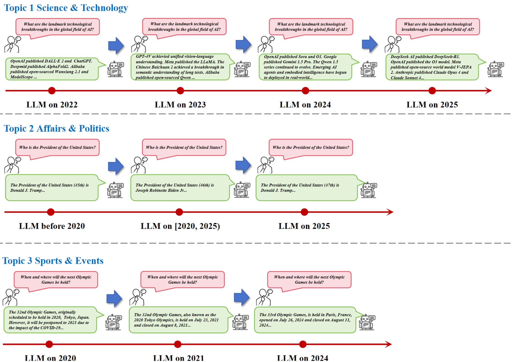

[](https://github.com/ecnu-sii/Continual-NExT/stargazers)
[](https://github.com/ecnu-sii/Continual-NExT/commits/main)
[](https://github.com/ecnu-sii/Continual-NExT/graphs/contributors)
[](https://huggingface.co/datasets/jingyang/Continual-News)

## Introduction

Continual-NExT is a continual learning benchmark for **Large Foundation Modals (LFMs)** developed based on the ms-swift framework, focusing on the catastrophic forgetting of LFMs in the process of continual evolution. It integrates multiple modalities, multiple models, multiple tuning paradigms, and multiple continual learning (CL) methods, allowing researchers to freely combine these components in developing new methods to solve **the trade-off between stability and plasticity** in LFMs.

In addition to using the datasets supported by the ms-swift framework, Continual-NExT also supports interfaces for continual fine-tuning of public and private datasets. In addition, we also provide a new open-source dataset based on Large Language Models (LLMs), **Continual-News Knowledge Evolution** to help researchers better understand the continual evolution process of LLMs.

In summary, our benchmark includes the following advantages:

**• Scalability:** Easily scales to accommodate multiple large language models (LLMs), large multimodal models (LMMs), parameter-efficient fine-tuners, and diverse datasets.

**• Flexibility:** Supports the flexible combination of diverse model architectures, parameter-efficient fine-tuning paradigms, and anti-forgetting methods.

**• Convenience:** Enables seamless usage with a one-command "plug-and-train" interface.

**• Extensibility:** Provides strong support and adaption of novel anti-forgetting methods.

## Installation
To install from source:
```shell
git clone https://github.com/ecnu-sii/Continual-NExT.git
cd Continual-NExT
pip install -e .
```

Running Environment:

|              | Range        | Recommended | Notes                                     |
| ------------ |--------------| ----------- | ----------------------------------------- |
| python       | >=3.9        | 3.10        |                                           |
| cuda         |              | cuda12      | No need to install if using CPU, NPU, MPS |
| torch        | >=2.0        |             |                                           |
| transformers | >=4.33       | 4.51.3      |                                           |
| modelscope   | >=1.23       |             |                                           |
| trl | >=0.13,<0.19 | 0.18 |RLHF|
| deepspeed    | >=0.14       | 0.14.5 / 0.16.9 | Training                                  |
| vllm         | >=0.5.1      | 0.8.5.post1       | Inference/Deployment/Evaluation           |
| lmdeploy     | >=0.5        | 0.8       | Inference/Deployment/Evaluation           |


For more optional dependencies, you can refer to [here](https://github.com/modelscope/ms-swift/blob/main/requirements/install_all.sh).

## Supported Models

| Model  |                         Model size	        |       Template          |       HF Model ID   |
| :----: | :------------------------------------------: | :---------------------: |:-----------------------: |
| [Qwen/Qwen2.5-7B](https://modelscope.cn/models/Qwen/Qwen2.5-7B)    | 7B | qwen2_5  | [Qwen/Qwen2.5-7B](https://huggingface.co/Qwen/Qwen2.5-7B) |
| [Shanghai_AI_Laboratory/internlm2_5-7b-chat](https://modelscope.cn/models/Shanghai_AI_Laboratory/internlm2_5-7b-chat) | 7B | internlm2 | [Shanghai_AI_Laboratory/internlm2_5-7b-chat](https://huggingface.co/internlm/internlm2_5-7b-chat) |
| [baichuan-inc/Baichuan2-7B-Chat](https://modelscope.cn/models/baichuan-inc/Baichuan2-7B-Chat) | 7B | baichuan |[baichuan-inc/Baichuan2-7B-Chat](https://huggingface.co/baichuan-inc/Baichuan2-7B-Chat) |


## Supported Peft Tuners

| Method |                         Description                          |                           Citation                           |
| :----: | :----------------------------------------------------------: | :----------------------------------------------------------: |
|  Adapter   | [Adapter Tuning](./assets/tuners/Adapter.md) | [https://arxiv.org/abs/1902.00751](https://arxiv.org/abs/1902.00751) |
|  LoRA      | [LoRA Tuning](./assets/tuners/LoRA.md) | [https://arxiv.org/abs/2106.09685](https://arxiv.org/abs/2106.09685) |
|  AdaLoRA   | [AdaLoRA Tuning](./assets/tuners/AdaLoRA.md) | [https://arxiv.org/abs/2303.10512](https://arxiv.org/abs/2303.10512) |
|  MoELoRA   | [MoELoRA Tuning](./assets/tuners/MoELoRA.md) | [https://arxiv.org/abs/2403.08350](https://arxiv.org/abs/2403.08350) |
|  Prompt-Tuning | [Prompt Tuning](https://github.com/ECNU-SII/Continual-NExT/blob/main/README.md) | [https://arxiv.org/abs/2403.08691](https://arxiv.org/abs/2104.08691) |
|  Prefix-Tuning | [Prefix Tuning](https://github.com/ECNU-SII/Continual-NExT/blob/main/README.md) | [https://arxiv.org/abs/2403.00190](https://arxiv.org/abs/2101.00190) |
|  P-Tuning | [P Tuning](https://github.com/ECNU-SII/Continual-NExT/blob/main/README.md) | [https://arxiv.org/abs/2403.10385](https://arxiv.org/abs/2103.10385) |

## Supported Methods

| Method |                         Description                          |                           Citation                           |
| :----: | :----------------------------------------------------------: | :----------------------------------------------------------: |
|  CIA   | [Large Continual Instruction Assistant](./assets/methods/CIA.md) | [https://arxiv.org/pdf/2410.10868](https://arxiv.org/pdf/2410.10868) |
|  EWC   | [Elastic Weight Consolidation](./assets/methods/EWC.md) | [https://arxiv.org/abs/1612.00796](https://arxiv.org/abs/1612.00796) |
|  GEM   | [Gradient Episodic Memory](./assets/methods/GEM.md) | [NeurIPS 2017](https://proceedings.neurips.cc/paper/2017/file/f87522788a2be2d171666752f97ddebb-Paper.pdf) |
|  LWF   | [Learning Without Forgetting](./assets/methods/LWF.md) | [TPAMI 2017](https://ieeexplore.ieee.org/ielaam/34/8520726/8107520-aam.pdf) |
| Reply  | [Experience Replay](./assets/methods/Reply.md) | [NeurIPS 2019](https://proceedings.neurips.cc/paper_files/paper/2019/file/fa7cdfad1a5aaf8370ebeda47a1ff1c3-Paper.pdf) |

## Training and Evaluation
For training 'reply' on Internlm2.5-7b
```shell
sh train/internlm_train_reply.sh
```

For training 'lwf' on Qwen2.5-7b
```shell
sh train/qwen_train_lwf.sh
```
Please note that the implementation of LWF in Qwen does not support flash_attn.

To calculate the performance metrics of the model results, we first need to deploy the model as a service.
```shell
sh evaluation/deploy.sh
```
Then, obtain the responses, save them as files, and calculate the metrics.
```python
python evaluation/test_ans.py
python evaluation/sim.py
```

### Distributed Training

SWIFT originally supports distributed training by using DDP/FSDP/DeepSpeed. In our modification, we select the DeepSpeed method to implement distributed training.  The following Table shows the compatibility status of each continual learning PEFT/method with various DeepSpeed ZeRO configurations.

| Method                                 | Single GPU | ZeRO-0 | ZeRO-1 | ZeRO-2 | ZeRO-3 | ZeRO-3+Offload |
| -------------------------------------- | :--------: | :----: | :----: | :----: | :----: | :------------: |
| LoRA Fine-Tuning                       |     ✅      |   ✅    |   ✅    |   ✅    |   ✅    |       ✅        |
| MoELoRA (Mixture of Experts with LoRA) |     ✅      |   ✅    |   ✅    |   ✅    |   ✅    |       ✅        |
| Experience Replay                      |     ✅      |   ✅    |   ✅    |   ✅    |   ✅    |       ✅        |
| Learning Without Forgetting (LWF)      |     ✅      |   ✅    |   ✅    |   ✅    |   ✅    |       ✅        |
| Elastic Weight Consolidation (EWC)     |     ✅      |   ✅    |   ✅    |   🚫    |   🚫    |       🚫        |
| Continual Instruction Tuning (CIA)     |     ✅      |   ✅    |   🚫    |   🚫    |   🚫    |       🚫        |
| Gradient Episodic Memory (GEM)         |     ✅      |   ✅    |   🚫    |   🚫    |   🚫    |       🚫        |

**Legend**:

- ✅ Compatible
- 🚫 Not compatible

**Incompatibility Reasons**:

- **GEM,**  **CIA**: Requires obtaining gradient and parameters which are incompatible with ZeRO-1 and above due to the way gradients and parameters are partitioned across devices.
- **EWC**: Requires obtaining parameters which are incompatible with ZeRO-2 and above due to the way parameters are partitioned across devices.

## Evaluation Metrics

Accuracy is obtained with the following steps:

1. **Encoding with BERT**
    We use a pretrained multilingual BERT model (e.g., `paraphrase-multilingual-MiniLM-L12-v2`) to convert each assistant reply and corresponding ground truth into a high-dimensional vector (embedding) that captures the **semantic meaning** of the text.

2. **Cosine Similarity Calculation**
    For each pair of replies and ground truths, we compute the **cosine similarity** between their embeddings. This value ranges from 0 (irrelated meaning) to 1 (identical meaning), with values close to 1 indicating that the two responses are semantically very similar.

3. **Output**
    We print the similarity score for each matched pair and compute the **average similarity score across all pairs**, which gives a quantitative measure of how semantically similar the assistant responses are between the replies and ground truths.

In conclusion, Accuracy can be calculated as:

$$\text{Similarity}(A,B)=\text{cos}(v_A,v_B)=\frac{v_A·v_B}{∥v_A∥·∥v_B∥}$$

$v_A$: The BERT embedding vector of text A

$v_B$: The BERT embedding vector of text B

$·$: Dot product of the two vectors

$∥⋅∥$: L2 norm (i.e., length) of the vector

$cos⁡(v_A,v_B)$: Cosine similarity between vectors A and B, ranging from 0 to 1

**Average Accuracy (Avg.ACC)** is used for averaging the test accuracy of all datasets, which represents the comprehensive performance of continual tuning.

$$\text{Average Accuracy} = \frac{1}{T}\sum_{i=1}^{T}A_{T,i},$$

**Forgetting (FOR)** is utilized to indicate the test accuracy reduction of past datasets after learning the new dataset, which denotes the stability performance.

$$\text{Forgetting} = \frac{1}{T-1}\sum_{i=1}^{T-1}{A_{T,i} – \text{max}(A_{j,i})_{j \in [i,T-1]}},$$

**New Accuracy (New.ACC)** is employed to average the test accuracy of new datasets, which refers to the plasticity performance.

$$\text{New Accuracy} = \frac{1}{T}\sum_{i=1}^{T}A_{i,i},$$

where $T$ is the number of datasets, $A_{T,i}$ is the accuracy of $i$-th dataset on the model trained after $T$-th dataset, $A_{j,i}$ is the accuracy of $i$-th dataset on the model trained after $j$-th dataset, and $A_{i,i}$ is the accuracy of $i$-th dataset on the model trained after $i$-th dataset.

## Experimental Results

We implemented two parameter efficient fine-tunings (*i.e.* LoRA and MoELoRA), and five continual learning methods (namely Replay, LWF, EWC, GEM and CIA based on LoRA fine-tuning) on our proposed Continual-News dataset. Results are shown in the following two Tables.

**Continual-News Results on InternLM2.5-7b-chat**

| Method  | 2022  | 2023  | 2024  |  2025  | Avg.ACC | Forgetting | New.ACC |
| :-----: | :---: | :---: | :---: | :----: | :-----: | :--------: | :-----: |
|  LoRA   | 64.25 | 58.94 | 71.53 |  100   |  73.68  |   34.41    |  99.49  |
| MoELoRA | 65.34 | 59.26 | 71.63 |  100   |  74.06  |   34.59    |   100   |
| RePlay  | 78.04 | 69.19 | 83.71 | 99.84  |  82.70  |   22.18    |  99.33  |
|   LWF   | 72.25 | 63.53 | 80.18 | 100.00 |  78.99  |   27.59    |  99.58  |
|   EWC   | 64.23 | 59.29 | 70.76 |  100   |  73.57  |   34.07    |  99.11  |
|   GEM   | 73.16 | 68.83 | 80.47 |  100   |  80.62  |   24.63    |  99.09  |
|   CIA   | 63.76 | 59.48 | 71.65 |  100   |  73.72  |   33.97    |  99.2   |


**Continual-News Results on Qwen2.5-7b**

| Method  | 2022  | 2023  | 2024  |  2025  | Avg.ACC | Forgetting | New.ACC |
| :-----: | :---: | :---: | :---: | :----: | :-----: | :--------: | :-----: |
|  LoRA   | 64.4  | 60.96 | 72.77 |  100   |  74.53  |   33.79    |  99.87  |
| MoELoRA | 65.26 | 61.52 | 72.32 |  100   |  74.78  |   33.62    |  99.99  |
| RePlay  | 77.90 | 68.43 | 81.14 | 100.00 |  81.87  |   24.18    |   100   |
|   LWF   | 73.79 | 65.31 | 81.93 | 99.94  |  80.24  |   24.51    |  98.62  |
|   EWC   | 66.6  | 61.96 | 73.92 |  100   |  75.62  |    32.5    |   100   |
|   GEM   | 74.1  | 67.7  | 82.03 |  100   |  80.96  |   25.39    |   100   |
|   CIA   | 66.92 | 62.88 | 74.62 |  100   |  76.11  |   31.86    |   100   |

Additionally, we also present a case (shown in the following Figure) that illustrates the continual knowledge update of LLMs.



## Acknowledgements

Continual-NExT is built upon the [SWIFT](https://github.com/modelscope/ms-swift), an excellent open-source framework developed by the ModelScope team. We extend our sincere gratitude for their outstanding contributions. SWIFT’s flexible and modular architecture has been instrumental in enabling the development of continual learning systems: Continual-NExT.

Before using Continual-NExT, we highly recommend familiarizing yourself with SWIFT by consulting its [README (English version)](https://github.com/modelscope/ms-swift/blob/main/README.md), [README-CN (Chinese version)](https://github.com/modelscope/ms-swift/blob/main/README_CN.md), and its comprehensive [documentation](https://swift.readthedocs.io/en/latest/index.html). These resources provide valuable insights into SWIFT’s core design principles and implementation details, which will greatly facilitate a deeper understanding and more effective usage of Continual-NExT.

## Future Plans

• We will publish a complex and hard continual tuning/evolution benchmark for **multimodal understanding** **MLLMs** with various architecture, PEFT and continual learning method.

• We will publish a novel and challenge continual tuning/evolution benchmark for **Any-to-Any MLLMs** with various architecture, PEFT and continual learning method.
