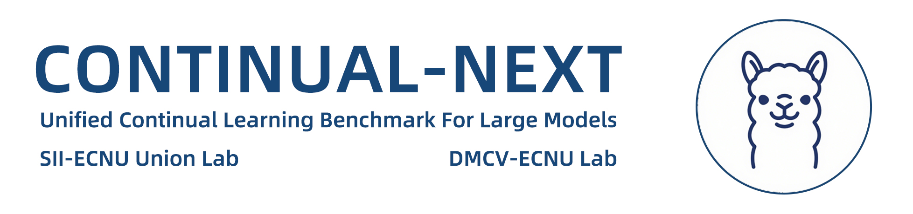

## Supported Methods

| Method |                         Description                          |                           Citation                           |
| :----: | :----------------------------------------------------------: | :----------------------------------------------------------: |
|  CIA   | [Large Continual Instruction Assistant](./assets/methods/cia.md) | [https://arxiv.org/pdf/2410.10868](https://arxiv.org/pdf/2410.10868) |

## 

## Evaluation Metrics

Accuracy is obtained with the following steps:

1. **Encoding with BERT**
    We use a pretrained multilingual BERT model (e.g., `paraphrase-multilingual-MiniLM-L12-v2`) to convert each assistant reply and corresponding ground truth into a high-dimensional vector (embedding) that captures the **semantic meaning** of the text.

2. **Cosine Similarity Calculation**
    For each pair of replies and ground truths, we compute the **cosine similarity** between their embeddings. This value ranges from 0 (irrelated meaning) to 1 (identical meaning), with values close to 1 indicating that the two responses are semantically very similar.

3. **Output**
    We print the similarity score for each matched pair and compute the **average similarity score across all pairs**, which gives a quantitative measure of how semantically similar the assistant responses are between the replies and ground truths.

In conclusion, Accuracy can be calculated as:

$$\text{Similarity}(A,B)=\text{cos}(v_A,v_B)=\frac{v_A·v_B}{∥v_A∥·∥v_B∥}$$

$v_A$: The BERT embedding vector of text A

$v_B$: The BERT embedding vector of text B

$·$: Dot product of the two vectors

$∥⋅∥$: L2 norm (i.e., length) of the vector

$cos⁡(v_A,v_B)$: Cosine similarity between vectors A and B, ranging from 0 to 1

**Average Accuracy (Avg.ACC)** is used for averaging the test accuracy of all datasets, which represents the comprehensive performance of continual tuning.

$$\text{Average Accuracy} = \frac{1}{T}\sum_{i=1}^{T}A_{T,i},$$

**Forgetting (FOR)** is utilized to indicate the test accuracy reduction of past datasets after learning the new dataset, which denotes the stability performance.

$$\text{Forgetting} = \frac{1}{T-1}\sum_{i=1}^{T-1}{A_{T,i} – \text{max}(A_{j,i})_{j \in [i,T-1]}},$$

**New Accuracy (New.ACC)** is employed to average the test accuracy of new datasets, which refers to the plasticity performance.

$$\text{New Accuracy} = \frac{1}{T}\sum_{i=1}^{T}A_{i,i},$$

where $T$ is the number of datasets, $A_{T,i}$ is the accuracy of $i$-th dataset on the model trained after $T$-th dataset, $A_{j,i}$ is the accuracy of $i$-th dataset on the model trained after $j$-th dataset, and $A_{i,i}$ is the accuracy of $i$-th dataset on the model trained after $i$-th dataset.

## Acknowledgements

Continual-NExT is built upon the [SWIFT](https://github.com/modelscope/ms-swift), an excellent open-source framework developed by the ModelScope team. We extend our sincere gratitude for their outstanding contributions. SWIFT’s flexible and modular architecture has been instrumental in enabling the development of continual learning systems: Continual-NExT.

Before using Continual-NExT, we highly recommend familiarizing yourself with SWIFT by consulting its [README (English version)](https://github.com/modelscope/ms-swift/blob/main/README.md), [README-CN (Chinese version)](https://github.com/modelscope/ms-swift/blob/main/README_CN.md), and its comprehensive [documentation](https://swift.readthedocs.io/en/latest/index.html). These resources provide valuable insights into SWIFT’s core design principles and implementation details, which will greatly facilitate a deeper understanding and more effective usage of Continual-NExT.

## Future Plans

• We will publish a complex and hard continual tuning/evolution benchmark for **multimodal understanding** **MLLMs** with various architecture, PEFT and continual learning method.

• We will publish a novel and challenge continual tuning/evolution benchmark for **Any-to-Any MLLMs** with various architecture, PEFT and continual learning method.
